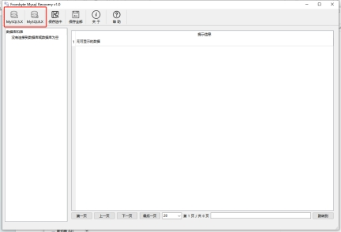
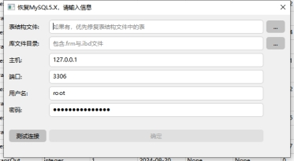
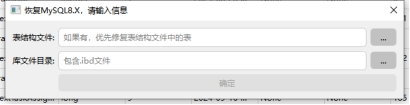
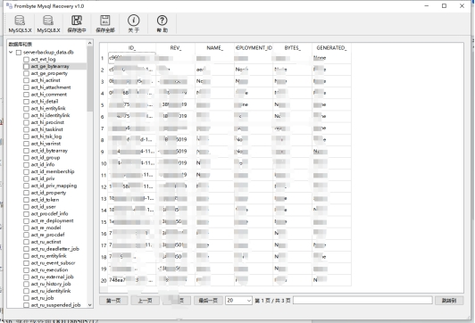
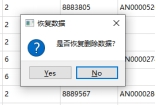
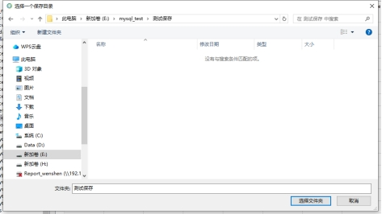

# MysqlRecover

#### 介绍
{
本工具 针对 Mysql innodb引擎，服务无法启动，丢失表信息，表结构信息恢复使用python开发的，本工具可解析5.6以上的表结构和表数据。是基于pyqt6开发的界面。

#### 使用说明

在python环境下安装pyqt6,即可运行，也可以直接在Windows环境下运行打包好的程序。

#### 使用步骤

软件的使用步骤。

第一步 确定要恢复的数据库版本，选择要恢复的按钮。

 

第二步 对于MySQL5版本的数据库，如果有表结构，可选择填入表结构文件（.sql文件）所在的路径，那么将优先恢复表结构文件内的表，库文件目录内填入库文件所在路径（包含.ibd文件，存在表结构可无.frm文件）；如果有表结构文件可不填主机、端口、用户名、密码。如果没有表结构文件，那么需要库文件目录内填入库文件所在路径（必须包含.ibd文件和.frm文件），并且还要填入本机的主机号、端口、用户名和密码。随后可以测试连接信息是否成功。点击确定就将开始恢复。

 

对于MySQL8版本的数据库只需要填入库文件所在路径，即可恢复。同时对于有表结构的可以优先恢复表结构内的内容。点击确定即可恢复

 

 

第三步，点击确定后，等待几分钟会在左侧出现该库，点击箭头可以看到该库下所有的表。可以点击某个表后等待几秒后查看该表内的数据（目前仅展示前100条，如有需要请联系）。

 

第四步 可以勾选某些表然后点击保存选中，也可点击保存全部会把恢复出的表全部保存。点击后会让选择是否恢复被删除数据，可选择“Yes”或“No”，然后会弹出保存位置，点击确定后等待几分钟（如数据量特别大，则等待时间也会很长）可在保存位置看到保存的sql文件。

 

 

注意：如出现软件卡顿，未响应等情况可能是因为数据量大导致等待几分钟即可，若还是未响应可尝试多次打开关闭软件后再次尝试，在数据量过大时建议分批次保存表。

该软件会在软件存放的上级目录下创建一个名为tempdata的临时文件夹，关闭软件时会自动删除。

如果需要误删除或者覆盖情况碎片扫描，大字段解析等，可联系我们加快恢复速度